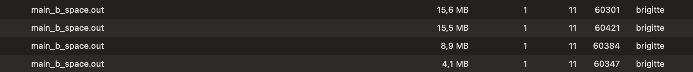

# Matrix-Vector Multiplication

## Running the Test

Command used to run the program:
```
make; ./main.out
```

Output:
```
Test #1:
Actual V[0] = 0 ; Expected V[0] = 0 
Actual V[1] = 0 ; Expected V[1] = 0 

Test #2:
Actual V[0] = 11; Expected V[0] = 11
Actual V[1] = 7 ; Expected V[1] = 7 

Test #3:
Actual V[0] = 17; Expected V[0] = 17
Actual V[1] = 29; Expected V[1] = 29
```

## Benchmark

### Time Complexity

Command used to run the program:
```
make time; ./main_b_time.out
```

Output: 

```
Time elapsed: 241.791962 ms
```
The amount of time needed to calculate the multiplication of $N\times N$ Matrix to the $\mathbf{N}$-Vector with the size of `N = 10000` is `241.791962 ms`.

Here is the graph showing the amount of time needed (in milliseconds) as the size of the matrix (N) goes higher.


### Space Complexity

Command used to run the program:
```
make space; ./main_b_space.out
```

Output:

I used my Macbook's Acitvity Monitor to view my results. 



I used four N respectively, `N = 500`, `N = 1000`, `N = 1500`, `N = 2000`.

Here is the graph showing the amount of memory needed (in megabytes) as the size of the matrix (N) increases.


